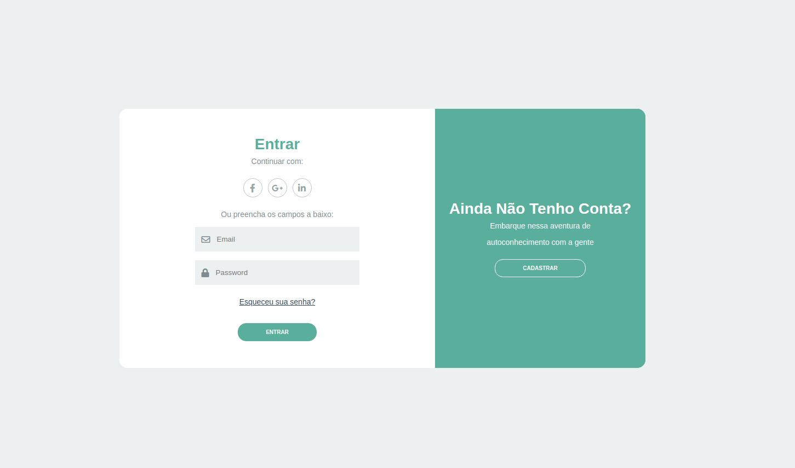
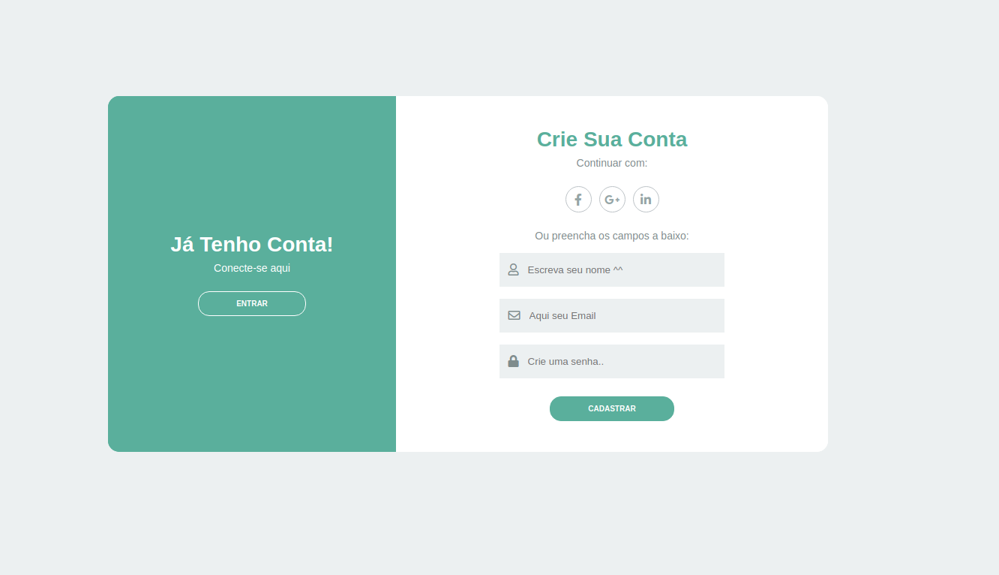
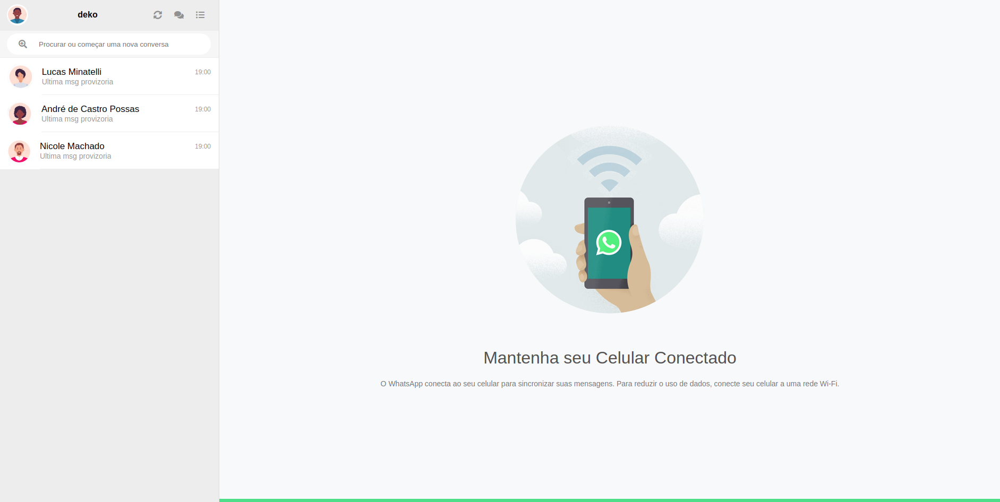
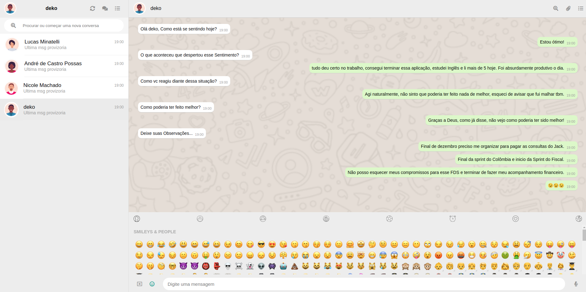

<h1 align="center">Chat Bot</h1>
<p align="center">Project dedicated to the practice of formik yup, simulating a chat bot.</p>


[](https://www.linkedin.com/in/andrepossas/)

Tabela de conteúdos
=================
<!--ts-->
   * [Features](#Features)
   * [ScreenShots](#ScreenShots)
   * [Installation](#Instalação)
   * [howToUse](#How-to-use)	
   * [Tecnologies](#tecnologias)
   * [Vídeo](#Video)
   * [Author](#Autor)
<!--te-->

<h2 align="center"> 
	🚧  React Select 🚀 Under construction...  🚧
</h2>

## Features
### Mandatory.

- [x] Formik
- [x] Yup
- [x] React
- [x] Axios
- [x] Dynamic Chat Bot
- [x] Registered Service
- [x] REDUX
- [x] Own components
- [x] Routes

### Differentials.

- [ ] Birthday and email validate system style.
- [ ] New state for incorrect data
- [ ] Auto complete state list
- [x] Readme
- [ ] Unitary tests

### Not rated.

- [x] SideBar
- [x] Header
- [ ] Face Book Login system
- [x] Backup System.
- [x] Routin Analiser
- [ ] Color system.

# ScreenShots

<h1 align="left">
  
</h1>
<h1 align="right">
  
</h1>
<h1 align="left">
  
</h1>
<h1 align="right">
  
</h1>

## Installation

Before starting, you will need to have the following tools installed on your machine:
[Git](https://git-scm.com), [Node.js](https://nodejs.org/en/). 
It's nice to have an editor to work with code like [VSCode](https://code.visualstudio.com/)

### Clone the project:
Open the command terminal and type:
```bash
git clone git@github.com:dekopossas/staff-management.git
```
or access this [link](git@github.com:dekopossas/staff-management.git) and download the zip.

### 🎲 Running the Back End (server)
The focus of the project was to demonstrate my skills with the frontend, so I used the backend that I consider as simple as possible and easy to do, Json Server.
In the project folder, open your terminal and follow the step by step:

```bash
# Access the backend project directory:
$ cd backend

# Install dependencies:
$ yarn

# Start the Backend with the command:
$ yarn start
```
### The server will start on port:3001 -

### 🎲 Running the Front End (site)
In a new terminal in the project's local folder follow this step by step:

```bash
# Access the frontend project directory:
$ cd frontend

# Install dependencies:
$ yarn

# Start the Backend with the command:
$ yarn start
```
Wait until the browser opens on port 3000

If you are using the npm package, the commands are different,
I recommend following the [documentation](https://www.npmjs.com/)

### HOW-TO-USE

- On the login screen:
	<p>1- Create and login to your account </p>

- On the main screen:
	<p>2- Start a new Suport</p>
	<p>3- Answer the bot's questions until the end.</p>
	<p>4- you can also browse through your recent calls.</p>

### 🛠 Technologies

The following tools were used in the construction of the project:

- [Json Server](https://github.com/typicode/json-server) Backend
- [React](https://pt-br.reactjs.org/) Framework
- [axios](https://github.com/axios/axios) Promise based HTTP client
- [date-fns](https://date-fns.org/) Time library
- [react hook form](https://react-hook-form.com/) forms library
- [SASS](https://sass-lang.com/) pre-processing CSS

### Vídeo

https://youtu.be/Auw3Yl_omlY

### Autor
---

Feito com ❤️ por André Possas 👋🏽 Entre em contato!


[](andrepossaster@gmail.com)
[](https://www.linkedin.com/in/andrepossas/)

### Problem

I`m having autenticator version system problem.
